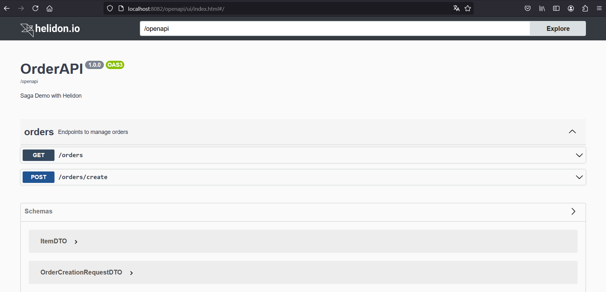

# OrderAPI


## Build and run


With JDK21
```bash
mvn package
java -jar target/orderapi.jar
```

## Exercise the application

Basic:
```
curl --location 'http://localhost:8082/api/orders/create' \
--header 'Content-Type: application/json' \
--data '{
    "customerId": "c382f61d-3e6e-4abd-a6d9-99d691a90847",
    "item": {
        "productId": "5895fbac-6a46-4122-a0af-6234ec7e633e",
        "price": 20,
        "quantity": 1
    }
}'
```


## Try health

```
curl -s -X GET http://localhost:8082/health
{"outcome":"UP",...

```

## OpenAPI

Find the open api documentation at http://localhost:8081/openapi



## Building the Docker Image

```
docker build -t orderapi .
```

## Running the Docker Image

```
docker run --rm -p 8082:8082 orderapi:latest
```

Exercise the application as described above.
                                
