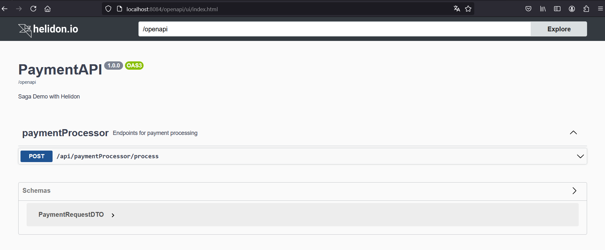

# PaymentAPI


## Build and run


With JDK21
```bash
mvn package
java -jar target/paymentapi.jar
```

## Exercise the application

Basic:
```
curl --location 'http://localhost:8084/api/paymentProcessor/process' \
--header 'Content-Type: application/json' \
--data '{
    "customerId": "c382f61d-3e6e-4abd-a6d9-99d691a90847",
    "totalUSD": 32.3
}'
```

## Try health

```
curl -s -X GET http://localhost:8084/health
{"outcome":"UP",...
```

## OpenAPI

Find the open api documentation at http://localhost:8084/openapi



## Building the Docker Image

```
docker build -t paymentapi .
```

## Running the Docker Image

```
docker run --rm -p 8084:8084 paymentapi:latest
```

Exercise the application as described above.
                                
