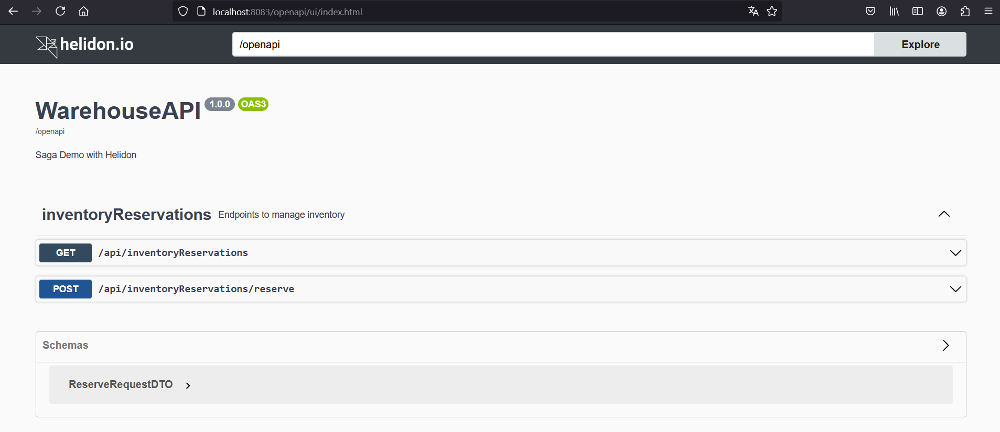

# WarehouseAPI


## Build and run


With JDK21
```bash
mvn package
java -jar target/warehouseapi.jar
```

## Exercise the application

Basic:
```
curl --location 'http://localhost:8083/api/inventoryReservations/reserve' \
--header 'Content-Type: application/json' \
--data '{
    "orderId": "32432",
    "productId": "55decd76-e3cd-4221-9137-1ddad73e5c29",
    "quantity": 100
}'
```

## Try health

```
curl -s -X GET http://localhost:8083/health
{"outcome":"UP",...

```

## OpenAPI

Find the open api documentation at http://localhost:8083/openapi



## Building the Docker Image

```
docker build -t warehouseapi .
```

## Running the Docker Image

```
docker run --rm -p 8083:8083 warehouseapi:latest
```

Exercise the application as described above.
                                
