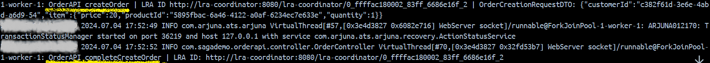
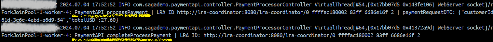

# Saga Pattern Demo 


## Orchestrated Saga with Helidon MicroProfile LRA

This example demonstrates how to implement an Orchestrated Saga using [MicroProfile LRA](https://download.eclipse.org/microprofile/microprofile-lra-2.0/microprofile-lra-spec-2.0.html) with [Helidon](https://helidon.io/).

The implemented saga is shown below:


The following is a small diagram of the interactions between the components of the LRA:


Our hypothetical online shop system is split into four scalable services:

- OrderProcessorAPI
- OrderAPI
- WarehouseAPI
- PaymentAPI

These services are entirely independent and integrated solely through REST API calls.

Additionally, an LRA Coordinator will be used, specifically the reference implementation [Narayana](https://www.narayana.io/lra/), which can be obtained via Docker at `quay.io/jbosstm/lra-coordinator`. It runs with Quarkus, is highly efficient, and production-ready.

It's important to mention that you can manage a load balancer in front of each API. However, in this demo, it is not being used because the [H2](https://www.h2database.com/html/main.html) database, which is in-memory, is being used for demonstration purposes. Additionally, it is important to note that the LRA Coordinator could communicate with the participants through a load balancer.

### Run With Docker

To simplify the deployment and demonstrate its functionality, I have created a Docker Compose file that includes all the necessary components for proper execution.

Steps:

1. First, you must generate images for each of the APIs. From the terminal, within the respective folder of each API, run the following commands:
    ```sh
    cd /path/to/your/orderprocessorapi
    docker build -t orderprocessorapi .
    cd /path/to/your/orderapi
    docker build -t orderapi .
    cd /path/to/your/warehouseapi
    docker build -t warehouseapi .
    cd /path/to/your/paymentapi
    docker build -t paymentapi .
    ```

2. Once the images have been generated correctly, simply execute the Docker Compose command. You can find this file in \Orchestrated:
    ```sh
    cd /path/to/your/docker-compose-file 
    docker-compose -p lra-demo up -d
    ```

3. Finally, if everything is set up correctly, you should be able to see the following containers:
    ```sh
    docker ps
    ```
   


### Test Saga

Checking Logs

To see logs you can use:

```
docker-compose -p lra-demo logs
```

#### Successful Case

To test a positive case, you should use the product ID 5895fbac-6a46-4122-a0af-6234ec7e633e, which has a stock of 80.

Request: 
```sh
curl --location 'http://localhost:8081/api/orderProcessor/placeOrder' \
--header 'Content-Type: application/json' \
--data '{
    "customerId": "c382f61d-3e6e-4abd-a6d9-54",
    "item": {
        "productId": "5895fbac-6a46-4122-a0af-6234ec7e633e",
        "price": 20,
        "quantity": 1
    }
}'
```

Response Example:

HTTP Status 200
```sh
{
    "correlationLRAId": "http://lra-coordinator:8080/lra-coordinator/0_ffffac180002_83ff_6686e16f_2",
    "orderId": "c1676076-9045-40bd-9c97-d374757e1eaf",
    "paymentId": "f8e1e351-2501-4ec9-b233-a37897032e1b",
    "reservationId": "0320e65a-9f67-4365-9225-d83572e3147a"
}
```
#### Participants Logs

OrderProcessorAPI


OrderAPI



WarehouseAPI


PaymentAPI



As you can see, the saga was executed successfully as a whole. Each participant performed its respective logic and was subsequently notified about the saga's completion. 
The endpoints annotated with @Complete and @AfterLRA were correctly invoked at the end.

To verify the state, you can use the following endpoints:

1. Request to get orders - OrderAPI
```
curl --location 'http://localhost:8082/api/orders'
```
Response


2. Request to get reservations - WarehouseAPI
```
curl --location 'http://localhost:8083/api/inventoryReservations'
```
Response


#### Failure Case #1

To produce a failure, we will request a product that doesn't exist.

Request:
```sh
curl --location 'http://localhost:8081/api/orderProcessor/placeOrder' \
--header 'Content-Type: application/json' \
--data '{
    "customerId": "c382f61d-3e6e-4abd-a6d9-54",
    "item": {
        "productId": "INVALID_PRODUCT",
        "price": 20,
        "quantity": 1
    }
}'
```

Response:

HTTP Status 409
```sh
{
    "errorCode": 1,
    "message": "There is no inventory for the product.",
    "statusCode": 409
}
```

It's important to note that you can obtain the LRA ID from the response in the header Long-Running-Action.

#### LRA Participants Logs

OrderProcessorAPI


OrderAPI


In this scenario, a business exception was triggered by WarehouseAPI due to a lack of inventory for the specified product. 
If the saga In this scenario, a business exception was triggered by WarehouseAPI due to a lack of inventory for the specified product.
If the saga is functioning correctly, the database should remain in a consistent state. This means that the order created in OrderAPI should be invalidated to reflect the failure in the process.

To verify the state, you can use the following endpoint:

```sh
curl --location 'http://localhost:8082/api/orders'
```

Response:


You can also produce a business exception on WarehouseAPI by requesting a high stock value, for example:

Example:
```sh
curl --location 'http://localhost:8081/api/orderProcessor/placeOrder' \
--header 'Content-Type: application/json' \
--data '{
    "customerId": "c382f61d-3e6e-4abd-a6d9-54",
    "item": {
        "productId": "5895fbac-6a46-4122-a0af-6234ec7e633e",
        "price": 20,
        "quantity": 10000
    }
}'
```

Response:
```
{
    "errorCode": 1,
    "message": "The requested quantity 10000 exceeds the available inventory of 10.",
    "statusCode": 409
}
```

In this case, the system will behave in the same way as with an invalid product.

#### Failure Case #2

To produce a failure in PaymentAPI, the last participant of the Saga, use the customer ID `c382f61d-3e6e-4abd-a6d9-99d691a90847`.

Request:
```sh
curl --location 'http://localhost:8081/api/orderProcessor/placeOrder' \
--header 'Content-Type: application/json' \
--data '{
    "customerId": "c382f61d-3e6e-4abd-a6d9-99d691a90847",
    "item": {
        "productId": "5895fbac-6a46-4122-a0af-6234ec7e633e",
        "price": 20,
        "quantity": 1
    }
}'
```

Response:

HTTP Status 409
```
{
    "errorCode": 2,
    "message": "Insufficient funds for this transaction.",
    "statusCode": 402
}
```

#### Participants Logs


OrderProcessorAPI


OrderAPI


WarehouseAPI


In this scenario, a business exception was triggered by WarehouseAPI due to a lack of inventory for the specified product. 
If the saga is functioning correctly, the database should remain in a consistent state. 
This means that the order created in OrderAPI should be invalidated to reflect the failure in the process.

To verify the state, you can use the following endpoint:

OrderAPI

```sh
curl --location 'http://localhost:8082/api/orders'
```

Response:


WarehouseAPI

```sh
curl --location 'http://localhost:8083/api/inventoryReservations'
```
Response:


In this other scenario, a business exception was triggered by PaymentAPI due to a payment-related issue. 
If the saga is functioning correctly, the system state should remain consistent.
In this specific case, the order and the reservation should be semantically rolled back, as shown in the images above.


### Requirements

- **Java:** Version 21.
- **Maven:** Version 3.9.6 or higher is preferable.
- **Docker:** Version 20.10.24 or higher is preferable.

### License

This project is licensed under the MIT License.

### Author

Diego Pérez V.